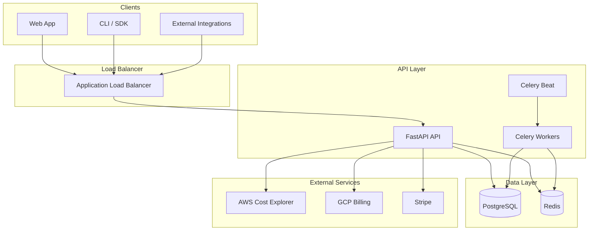
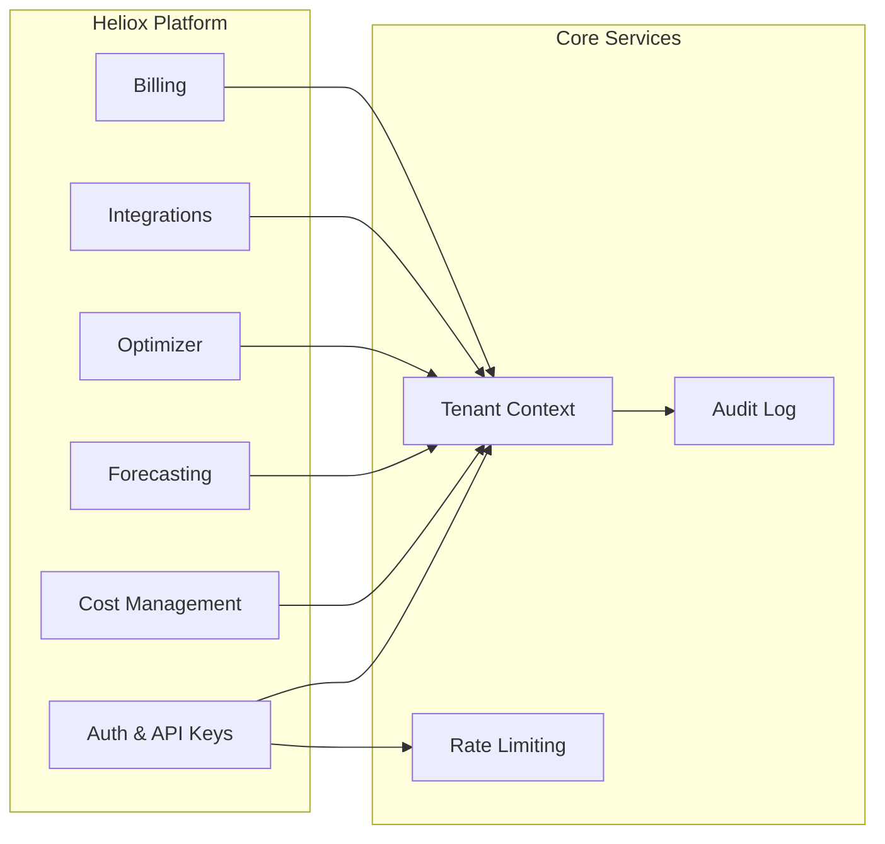
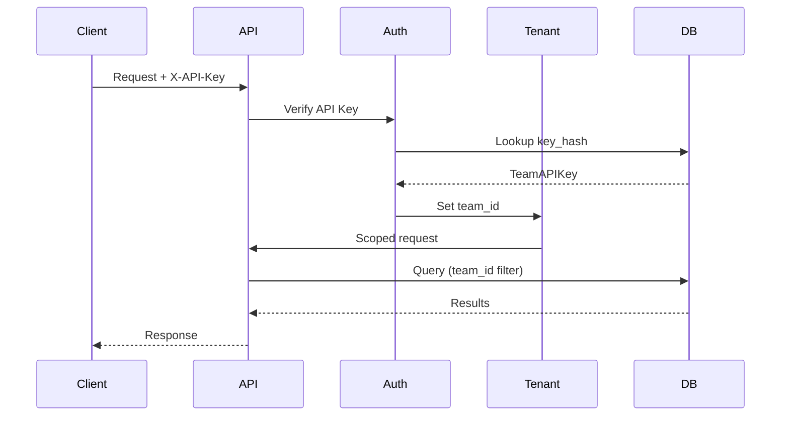
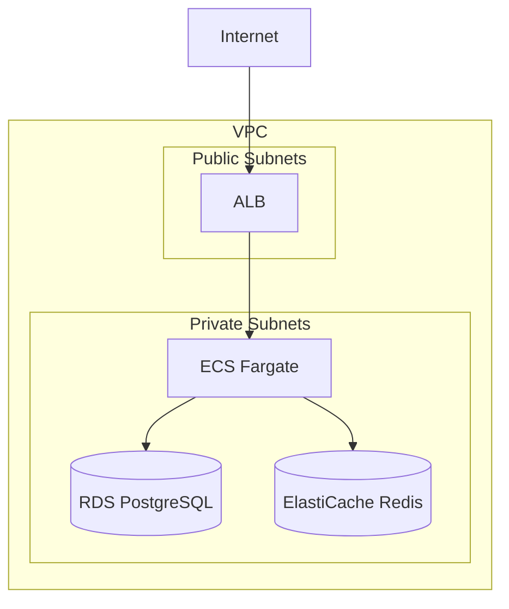

# Heliox System Architecture

## High-Level Architecture Diagram

```mermaid
flowchart TB
    subgraph Clients
        WebApp[Web App]
        CLI[CLI / SDK]
        Integrations[External Integrations]
    end

    subgraph "Load Balancer"
        ALB[Application Load Balancer]
    end

    subgraph "API Layer"
        API[FastAPI API]
        Workers[Celery Workers]
        Beat[Celery Beat]
    end

    subgraph "Data Layer"
        Postgres[(PostgreSQL)]
        Redis[(Redis)]
    end

    subgraph "External Services"
        AWS[AWS Cost Explorer]
        GCP[GCP Billing]
        Stripe[Stripe]
    end

    WebApp --> ALB
    CLI --> ALB
    Integrations --> ALB
    ALB --> API

    API --> Postgres
    API --> Redis
    Workers --> Postgres
    Workers --> Redis
    Beat --> Workers

    API --> AWS
    API --> GCP
    API --> Stripe
```

## Component Diagram

```mermaid
flowchart LR
    subgraph "Heliox Platform"
        Auth[Auth & API Keys]
        Costs[Cost Management]
        Forecast[Forecasting]
        Optimize[Optimizer]
        Integrations[Integrations]
        Billing[Billing]
    end

    subgraph "Core Services"
        Tenant[Tenant Context]
        RateLimit[Rate Limiting]
        Audit[Audit Log]
    end

    Auth --> Tenant
    Costs --> Tenant
    Forecast --> Tenant
    Optimize --> Tenant
    Integrations --> Tenant
    Billing --> Tenant

    Auth --> RateLimit
    Tenant --> Audit
```

## Data Flow

```mermaid
sequenceDiagram
    participant Client
    participant API
    participant Auth
    participant Tenant
    participant DB

    Client->>API: Request + X-API-Key
    API->>Auth: Verify API Key
    Auth->>DB: Lookup key_hash
    DB-->>Auth: TeamAPIKey
    Auth->>Tenant: Set team_id
    Tenant->>API: Scoped request
    API->>DB: Query (team_id filter)
    DB-->>API: Results
    API-->>Client: Response
```

## Deployment Architecture (AWS)

```mermaid
flowchart TB
    subgraph "VPC"
        subgraph "Public Subnets"
            ALB[ALB]
        end
        subgraph "Private Subnets"
            ECS[ECS Fargate]
            RDS[(RDS PostgreSQL)]
            ElastiCache[(ElastiCache Redis)]
        end
    end

    Internet --> ALB
    ALB --> ECS
    ECS --> RDS
    ECS --> ElastiCache
```
